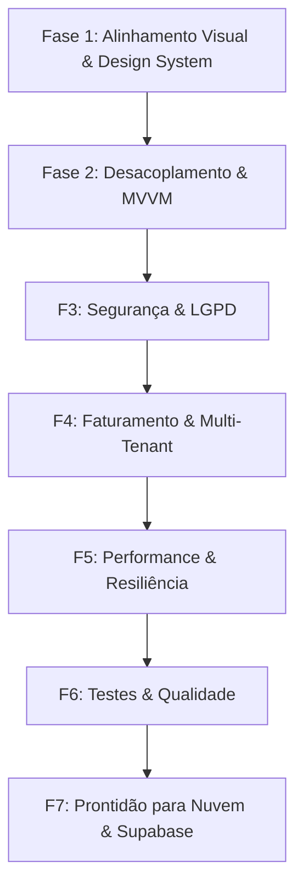

# Plano de Ação - EasyClin SaaS

Este documento estabelece o planejamento estratégico e a arquitetura em etapas para o desenvolvimento do **EasyClin**, um SaaS de gestão de saúde premium e orientado a resultados, unindo a força de precificação e lucro real do **QiDent** com a excelência operacional do **Simples Dental**.

O desenvolvimento será norteado pelos princípios de **código limpo, desacoplamento (Clean Architecture), padrão MVVM, mobile-first, segurança (LGPD) e alta escalabilidade**.

---

## 🗺️ Visão Geral das Fases



---

## 🎨 FASE 1: Alinhamento com o Design System (Tarefa Prioritária)
**Objetivo:** Elevar a qualidade visual do projeto ao padrão exato proposto pelas especificações e mockups contidos na pasta `engenharia_de_software/design_system`. 

### [ ] Tarefa 1.1: Consolidação do Core Temático no Tailwind CSS v4
- **O que fazer:** Ajustar o arquivo `src/index.css` na diretiva `@theme` para refletir as variáveis exatas de cores, tipografia, bordas e espaçamentos do arquivo `kinetic_medical/DESIGN.md`.
- **Tokens a mapear:**
  - Cores: `primary (#003ec7)`, `primary-container (#0052ff)`, `surface (#faf8ff)`, `on-surface (#131b2e)`, `error (#ba1a1a)`, `success (#10b981)`, etc.
  - Border Radius: `lg: 0.5rem (8px)`, `xl: 0.75rem (12px)`, `full: 9999px`.
  - Fontes: `Inter` como fonte padrão e `JetBrains Mono` para dados tabulares.

### [ ] Tarefa 1.2: Redesenho Completo da Tela de Autenticação (`Auth.tsx`)
- **O que fazer:** Refatorar a visualização de login seguindo os moldes exatos de `login_easyclin/code.html`.
- **Elementos críticos:** Efeito de vidro (`glass-card`), gradiente suave de fundo (`soft-gradient`), cabeçalho da logo centralizado, inputs com ícones e estados de foco contornados em anel azul de 2px, suporte a modo escuro e transições animadas.

### [ ] Tarefa 1.3: Redesenho do Dashboard Principal (`ClinicDashboard.tsx`)
- **O que fazer:** Reconstruir o layout estrutural do dashboard, menu lateral fixo (aside) e topo (header) em total conformidade com `dashboard_principal_easyclin/code.html`.
- **Elementos críticos:** Menu de navegação lateral com ícones da Google Material Symbols, cabeçalho de topo contendo busca em pílula, botões de ação expressiva (`+ Novo Paciente`, `+ Novo Agendamento`) e avatar premium.

### [ ] Tarefa 1.4: Refatoração da Agenda Central (`AgendaPanel.tsx`)
- **O que fazer:** Ajustar a interface da agenda utilizando as referências e elementos visuais de `agenda_easyclin/code.html`.
- **Elementos críticos:** Visualização de cartões de agendamento com bordas arredondadas e cores baseadas no status, badges de status estilizados em preenchimento de baixo contraste (fundo 10% opacidade, texto 100%), e cabeçalho de controle de períodos.

### [ ] Tarefa 1.5: Refatoração da Gestão de Fichas e Prontuários (`PatientPanel.tsx`)
- **O que fazer:** Redesenhar a listagem de pacientes, evolução clínica e a timeline de prontuário baseando-se em `prontu_rio_easyclin/code.html` e `cadastro_de_pacientes_easyclin/code.html`.
- **Elementos críticos:** Alertas médicos destacados (Ex: Alérgicos, Cardiopatas), fichas clínicas organizadas em abas e timeline de evolução com assinaturas e chaves de travamento visual (LGPD).

### [ ] Tarefa 1.6: Refatoração de Orçamentos e Precificação (`BudgetPanel.tsx` & `QiDentCalculator.tsx`)
- **O que fazer:** Unificar a tela de propostas e a calculadora de margem QiDent para herdar os elementos de `or_amento_e_precifica_o_easyclin/code.html`.
- **Elementos críticos:** Exibição clara e premium de tabelas de custos, detalhamento analítico da margem bruta de contribuição e simulação visual dos lucros de cada procedimento proposto.

### [ ] Tarefa 1.7: Redesenho do Fluxo Financeiro (`FinancePanel.tsx`)
- **O que fazer:** Elevar a qualidade visual dos gráficos de receitas/despesas e do fluxo de caixa conforme `financeiro_easyclin/code.html`.
- **Elementos críticos:** Gráficos de barras premium em HSL/RGB dinâmicos, tabelas sem bordas verticais, com hover sutil nas linhas e badges coloridos para categorias.

### [ ] Tarefa 1.8: Redesenho do Módulo Super Admin (`SuperAdmin.tsx`)
- **O que fazer:** Ajustar as telas administrativas da plataforma SaaS com base nos arquivos `dashboard_admin_plataforma_easyclin/code.html` e `assinatura_e_planos_easyclin/code.html`.
- **Elementos críticos:** KPIs de negócios do SaaS (MRR, Churn, ARPU), listagem de clínicas assinantes, e controle de suspensão/pausa das assinaturas de forma elegante.

---

## 🏗️ FASE 2: Arquitetura Limpa & Desacoplamento MVVM
**Objetivo:** Isolar a lógica de apresentação da lógica de negócios, criando uma arquitetura modular por domínio com injeção de dependências e desacoplamento total da persistência.

```
┌─────────────────────────────────────────────────────────┐
│                   Presentation Layer                    │
│        (React Components & Clean Design System UI)       │
└────────────────────────────┬────────────────────────────┘
                             ▼
┌─────────────────────────────────────────────────────────┐
│                    ViewModel Layer                      │
│        (Component State, User Intents, Reactive)        │
└────────────────────────────┬────────────────────────────┘
                             ▼
┌─────────────────────────────────────────────────────────┐
│               Use Cases & Domain Models                 │
│         (Pure Business Rules, QiDent Formulas)          │
└────────────────────────────┬────────────────────────────┘
                             ▼
┌─────────────────────────────────────────────────────────┐
│               Repository Interfaces (Ports)             │
│          (Abstract Database Definitions & Contracts)     │
└────────────────────────────┬────────────────────────────┘
                             ▼
┌─────────────────────────────────────────────────────────┐
│             Infrastructure Adapters (Adapters)          │
│       (Supabase / LocalStorage / External APIs)         │
└─────────────────────────────────────────────────────────┘
```

### [ ] Tarefa 2.1: Modelos de Domínio Puros (Domain Models)
- Criar a pasta `src/domain` e isolar regras puras e entidades (ex: regras de precificação QiDent em uma classe ou função pura `QiDentCalculatorService.ts`).
- Garantir que as entidades no domínio não contenham menções a bibliotecas externas, frameworks ou bancos de dados.

### [ ] Tarefa 2.2: Contratos de Persistência (Abstract Repositories)
- Criar a pasta `src/domain/repositories` e definir as interfaces estruturadas de persistência:
  - `UserRepository.ts`
  - `TenantRepository.ts`
  - `PatientRepository.ts`
  - `AppointmentRepository.ts`
  - `BudgetRepository.ts`
  - `TransactionRepository.ts`
  - `AuditLogRepository.ts`

### [ ] Tarefa 2.3: Adaptador LocalStorage (Infrastructure Adapter)
- Criar a pasta `src/infrastructure/repositories` e implementar adaptadores que satisfazem as interfaces do domínio utilizando o `localStorage` (Ex: `LocalStoragePatientRepository.ts`).
- Isso isola o atual mock `db.ts` e permite que o front-end mude de banco com um único arquivo de configuração.

### [ ] Tarefa 2.4: Casos de Uso (Application Services / Use Cases)
- Criar a pasta `src/application/usecases` e centralizar operações com múltiplas etapas ou regras críticas:
  - `CalculaLucroRealUseCase.ts`
  - `RegistraConsultaAgendadaUseCase.ts`
  - `GeraAuditoriaEvolucaoUseCase.ts`
  - `RegularizaPagamentoSaaSUseCase.ts`

### [ ] Tarefa 2.5: Implementação do Padrão MVVM (ViewModels)
- Criar a pasta `src/presentation/viewmodels`.
- Desenvolver ViewModels reativos que expõem o estado para a UI e lidam com as intenções do usuário (Ex: `AgendaViewModel.ts`, `PatientViewModel.ts`), chamando os Casos de Uso.
- O componente React passará a conter apenas UI e chamará `viewModel.handleAction()`.

---

## 🔒 FASE 3: Segurança Avançada, Auditoria & Conformidade LGPD
**Objetivo:** Garantir integridade de dados clínicos, segregação rígida entre clínicas (multi-tenant) e logs de auditoria à prova de adulteração.

### [ ] Tarefa 3.1: Filtro Rígido de Tenant (Tenant Segregation)
- Garantir que toda operação de leitura, gravação ou busca nos Repositórios passe obrigatoriamente e implicitamente o `tenantId` do usuário autenticado no contexto.
- Prevenir vazamento de dados (*cross-tenant data leaks*) validando a identidade no repositório.

### [ ] Tarefa 3.2: Prontuário Clínico em Conformidade com LGPD
- Implementar controle de travamento de prontuário: após o fechamento, o registro médico (`evolutionNotes`) torna-se somente-leitura.
- Se houver necessidade de retificação, o profissional deve criar um termo aditivo associado ao prontuário, registrando o motivo, sem alterar o histórico original.
- Implementar hash de integridade dos registros de saúde para auditorias da LGPD.

### [ ] Tarefa 3.3: Auditoria Completa e Inviolável
- Todo evento de leitura de dados sensíveis (prontuários, dados financeiros, CPFs dos pacientes) deve disparar um log na tabela `AuditLog`.
- Registros críticos como exclusões, alterações financeiras ou alterações de permissão devem conter metadados como endereço IP fictício e identificação inequívoca do operador.

### [ ] Tarefa 3.4: Blindagem Sanitária no Frontend
- Adicionar sanitização robusta nos formulários contra injeção de HTML/XSS.
- Garantir que erros internos do banco ou chaves secretas nunca sejam printados em tela ou vazados no console de desenvolvimento.

---

## 💳 FASE 4: Faturamento SaaS Multi-Tenant & Ciclo de Cobrança
**Objetivo:** Estruturar as regras e fluxos de faturamento SaaS, desde o período de testes (Trial) até bloqueios automáticos por inadimplência.

### [ ] Tarefa 4.1: Gerenciamento Visual de Planos e Cobrança
- Criar uma aba ou tela de Assinatura para a Clínica Administradora, onde ela pode ver o plano contratado, data do próximo vencimento, e histórico de faturas simuladas.
- Permitir simulações de cenários de pagamento com cartões ou Pix fictícios.

### [ ] Tarefa 4.2: Automação de Acesso por Status Financeiro
- Implementar a verificação de status do inquilino (`Tenant.status`):
  - `active` ou `trial`: Acesso total concedido.
  - `pending` (atraso de 1 a 14 dias): Exibe alerta sutil de cobrança em atraso, mas libera o uso.
  - `suspended` (atraso > 15 dias): Trava totalmente as telas do operador (Agenda, Prontuário, Financeiro) com a tela de bloqueio e link rápido para regularização financeira.
- Realizar liberação e bloqueio automáticos baseados nas datas e status simulados.

### [ ] Tarefa 4.3: Interface Pluggable de Pagamentos
- Criar um adaptador abstrato `PaymentProviderPort.ts` e criar adaptadores iniciais (Mock) para simular pagamentos reais de PIX/Cartão, estruturando o projeto para APIs como Stripe, Asaas ou Efí.

---

## ⚡ FASE 5: Performance, Jobs Assíncronos & Extensibilidade
**Objetivo:** Preparar o SaaS para rodar com eficiência sob grandes cargas de dados e permitir integrações com sistemas externos (WhatsApp, Notificações).

### [ ] Tarefa 5.1: Paginação e Filtros Avançados
- Refatorar tabelas de Pacientes, Financeiro e Auditoria para suportar paginação sob demanda em nível de repositório, mitigando consumo excessivo de memória em bases muito grandes.

### [ ] Tarefa 5.2: Fila de Jobs e Eventos Internos
- Criar um Event Bus interno simplificado para processar tarefas assíncronas (Ex: quando uma consulta é marcada, dispara um evento interno `AppointmentCreatedEvent`).
- Escutar esse evento para simular o envio de mensagens de confirmação automáticas via WhatsApp (CRM) e adicionar aos logs.

### [ ] Tarefa 5.3: Otimizações de Renderização no React
- Utilizar técnicas de memorização (`useMemo`, `useCallback`) nos painéis complexos para evitar re-renderizações desnecessárias ao digitar em inputs ou interagir com o calendário da agenda.

---

## 🧪 FASE 6: Testes & Garantia de Qualidade
**Objetivo:** Assegurar robustez, ausência de regressões e a consistência das operações financeiras e de saúde críticas.

### [ ] Tarefa 6.1: Configuração do Ambiente de Testes
- Instalar e configurar o Vitest (ou Jest) no ecossistema Vite + TypeScript.

### [ ] Tarefa 6.2: Testes Unitários de Regras de Negócio
- Implementar testes unitários para a calculadora QiDent (garantindo que margem desejada, custo e comissões fechem exatamente os lucros e preços ideais).
- Testar regras de bloqueio/desbloqueio automático baseados na data de vencimento.

### [ ] Tarefa 6.3: Testes de ViewModel e Fluxo de Caso de Uso
- Testar o comportamento das ViewModels isoladamente das views (garantindo que ações como `login`, `criarPaciente` e `travarProntuario` chamem os respectivos use cases e salvem nos repositórios).

---

## ☁️ FASE 7: Integração com Nuvem (Supabase Adapter)
**Objetivo:** Conectar a aplicação a um banco de dados real em nuvem de forma imediata, bastando habilitar uma chave ou variável de ambiente.

### [ ] Tarefa 7.1: Implementação dos Supabase Repositories
- Criar uma pasta `src/infrastructure/supabase` e escrever os adaptadores de repositório utilizando a SDK do Supabase.
- Ex: `SupabasePatientRepository.ts` implementa as consultas reais em tabelas relacionais do Supabase.

### [ ] Tarefa 7.2: Chave de Feature Flag de Infraestrutura
- Criar uma variável no `.env` ou arquivo de configuração central do sistema (Ex: `INFRASTRUCTURE_MODE = 'local' | 'supabase'`).
- Utilizar uma Fábrica de Repositórios (`RepositoryFactory.ts`) que injeta a classe correta com base nessa flag. Dessa forma, com 1 clique o SaaS passa do localStorage para nuvem real.

### [ ] Tarefa 7.3: Script de Schema SQL do Banco de Dados
- Criar os arquivos de migração SQL (`schema.sql`) contendo toda a estrutura de tabelas, chaves estrangeiras, regras de RLS (Row Level Security) para Supabase e triggers de auditoria em nuvem.

---

## 📆 Cronograma Estimado de Execução

| Fase | Título | Estimativa de Esforço | Prioridade |
|---|---|---|---|
| **Fase 1** | Alinhamento Visual & Design System | 4-5 dias | ⭐ CRÍTICA / ALTA |
| **Fase 2** | Arquitetura Clean, Repositórios & MVVM | 3-4 dias | ALTA |
| **Fase 3** | Segurança Rígida, LGPD & Auditorias | 2 dias | MÉDIA-ALTA |
| **Fase 4** | Faturamento SaaS & Cobranças | 2 dias | MÉDIA |
| **Fase 5** | Performance & Integrações Assíncronas | 2 dias | MÉDIA |
| **Fase 6** | Testes Unitários e Integração | 3 dias | ALTA |
| **Fase 7** | Conexão Real Supabase e Script SQL | 3 dias | MÉDIA |

---
**Nota de Evolução:** Este plano de ação é um documento dinâmico. À medida que cada etapa for executada, este documento deve ser atualizado com marcas de check `[x]` e observações de implantação relevantes.
